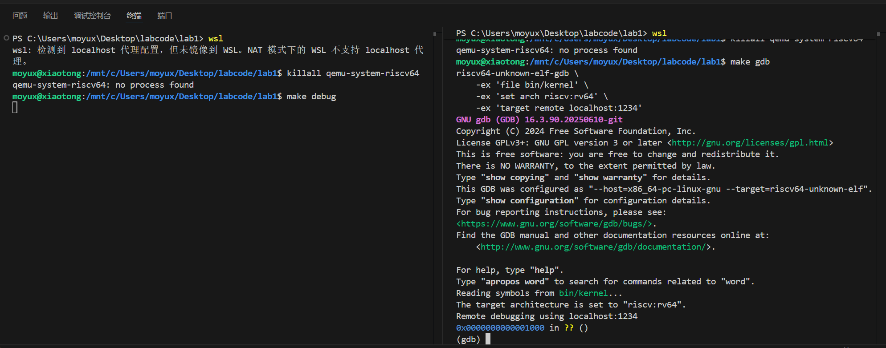
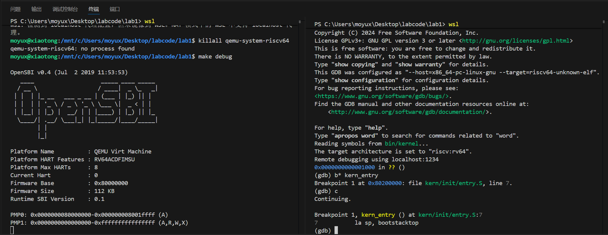
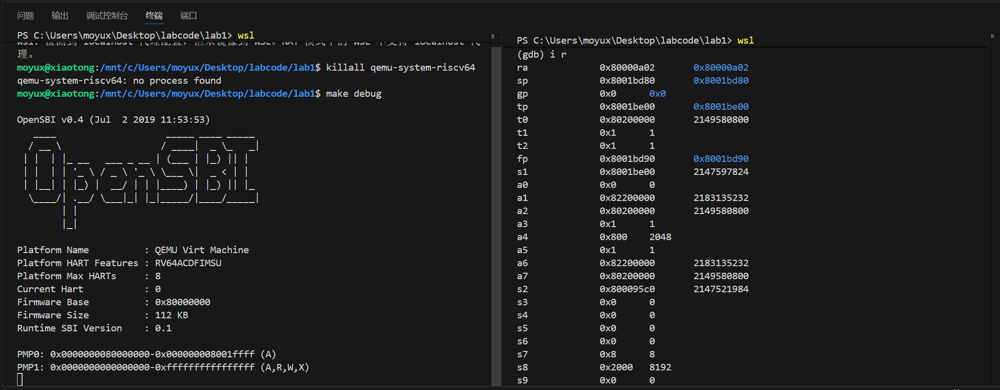
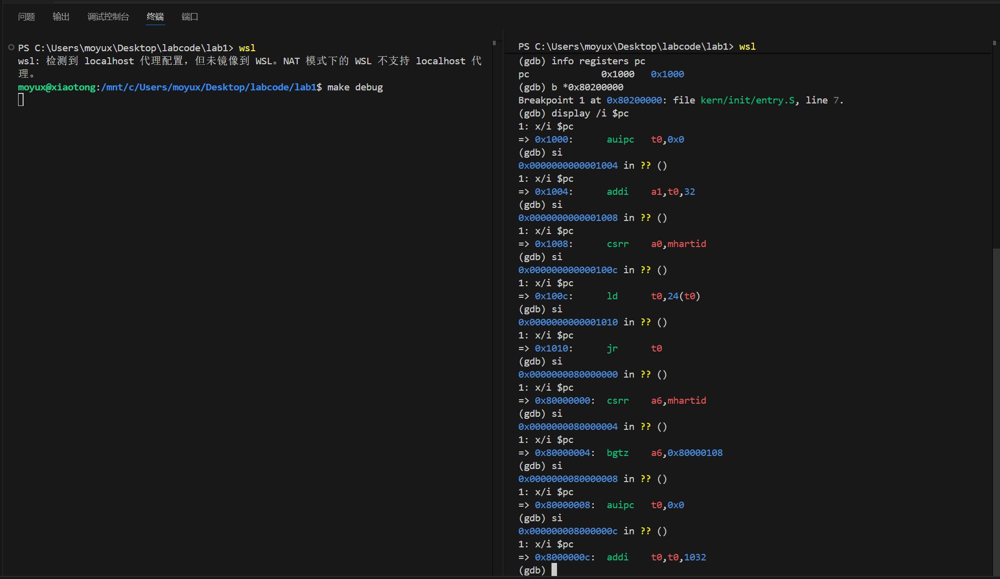
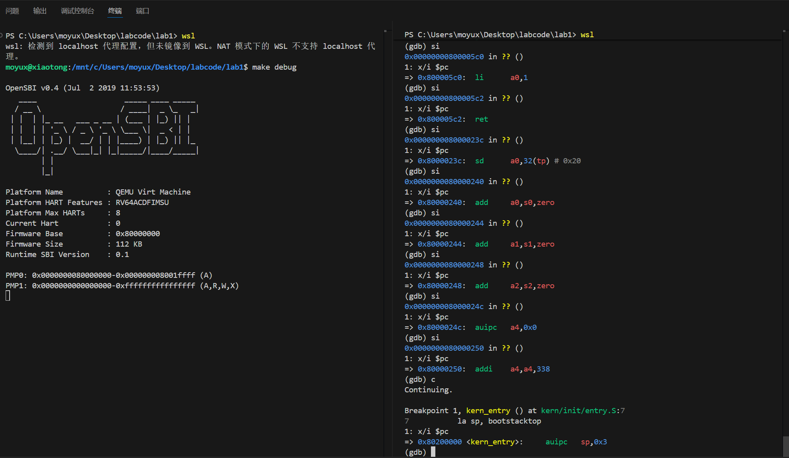
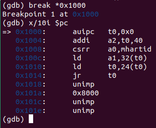
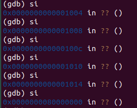

# 实验报告：[Lab1]

**作者：** [刘玥彤2312747] [杨凝霜2314009]

---


### 1.1 实验目的

实验1主要讲解最小可执行内核和启动流程。我们的内核主要在 Qemu 模拟器上运行，它可以模拟一台 64 位 RISC-V 计算机。为了让我们的内核能够正确对接到 Qemu 模拟器上，需要了解 Qemu 模拟器的启动流程，还需要一些程序内存布局和编译流程（特别是链接）相关知识。
本章你将学到：

- 使用 链接脚本 描述内存布局
- 进行 交叉编译 生成可执行文件，进而生成内核镜像
- 使用 OpenSBI 作为 bootloader 加载内核镜像，并使用 Qemu 进行模拟
- 使用 OpenSBI 提供的服务，在屏幕上格式化打印字符串用于以后调试
  
---

### 1.2 实验内容

实验1主要讲解最小可执行内核和启动流程。我们的内核主要在 Qemu 模拟器上运行，它可以模拟一台 64 位 RISC-V 计算机。为了让我们的内核能够正确对接到 Qemu 模拟器上，需要了解 Qemu 模拟器的启动流程，还需要一些程序内存布局和编译流程（特别是链接）相关知识,以及通过opensbi固件来通过服务。

---

### 2.1 练习1：理解内核启动中的程序入口操作

阅读 kern/init/entry.S内容代码，结合操作系统内核启动流程，说明指令 la sp, bootstacktop 完成了什么操作，目的是什么？ tail kern_init 完成了什么操作，目的是什么？

**下部分由【刘玥彤2312747】编写。**

1.**la sp, bootstacktop指令**
bootstacktop 标签在文件的 .data 段中被定义，它位于 bootstack 这块预留的栈内存空间的最高地址处。执行指令将 bootstacktop 这个标签的内存地址加载到 sp 寄存器中，这样，sp 寄存器就指向了内核初始栈的顶部。
这条指令的目的是初始化内核的第一个栈，设置一个合法的栈指针，为 C 函数调用做准备。

2.**tail kern_init指令**
它使程序的执行流直接跳转到 kern_init 标签所在的地址，并且不会在栈上保存返回地址。这意味着，kern_entry 这个函数的使命到此结束，程序将一去不复返地进入 kern_init 函数。
这条指令的目的是将控制权从汇编代码移交给 C 代码。汇编代码 kern_entry 的任务已经完成，现在需要跳转到用 C 语言编写的内核主初始化函数 kern_init() 中，并且永远不需要返回。

**下部分由【杨凝霜2314009】编写。**

阅读 kern/init/entry.S内容代码，结合操作系统内核启动流程，说明：

- 指令 `la sp, bootstacktop` 完成了什么操作，目的是什么？

  答：该指令将`bootstacktop` 的地址加载到栈指针寄存器 `sp` 中。目的是为内核代码的执行建立栈空间，将栈指针指向预先分配的内核栈的顶部。

- tail kern_init 完成了什么操作，目的是什么？

​	答：`tail` 是尾调用伪指令，相当于直接跳转，跳转到 `kern_init` 函数，是“真正的”内核入口点。使用尾调用优化，不会在栈上创建新的栈帧。


### 2.2 练习2: 使用GDB验证启动流程

为了熟悉使用 QEMU 和 GDB 的调试方法，请使用 GDB 跟踪 QEMU 模拟的 RISC-V 从加电开始，直到执行内核第一条指令（跳转到 0x80200000）的整个过程。通过调试，请思考并回答：RISC-V 硬件加电后最初执行的几条指令位于什么地址？它们主要完成了哪些功能？请在报告中简要记录你的调试过程、观察结果和问题的答案。

**下部分由【刘玥彤2312747】编写。**

1.  **准备工作：** 
   配置RISC-V GDB环境，并启动QEMU模拟器。

2.  **核心操作：** 
   在vscode中使用“拆分终端”，在左边的终端中执行*make debug*，负责启动 QEMU 并让它等待，在右边的终端中执行*make gdb*。
   
   现在我们执行几条指导书上的指令验证一下环境是否配置成功。
   执行 *b kern_entry* 指令，将调试器（GDB）定位到内核入口点并设置断点。输出表示 GDB 成功地将符号 kern_entry 解析为了内存地址 0x80200000，证明代码被正确地链接和加载到了预期的位置。
   执行 c 指令，让程序继续执行，并等待断点。
   Breakpoint 1, kern_entry () at kern/init/entry.S:7表示它命中了我们之前设置的 1 号断点，停止的位置是 kern_entry 函数，位于 entry.S 文件的第 7 行。并且显示了程序即将要执行的下一条指令的源代码。
   
   执行 i r 指令，查看当前所有寄存器的值。ra , sp 的值都在 0x8001xxxx 范围内，这表明 CPU 暂停时，正在执行的代码和使用的栈都位于 OpenSBI 的内存空间内。
   
   执行 info registers pc 指令，查看当前正在执行的指令.程序计数器的值是 0x1000,表明当前暂停在 QEMU 模拟的 ROM 中的复位地址处。
   执行 b *0x80200000 设置断点，这个地址是内核代码第一条指令所在的位置。
   执行 display /i $pc ，自动显示当前正在执行的指令。
   反复执行 si 指令，让程序单步执行，可以查看当前正在执行的指令。
   下图展示的过程主要是先通过一系列 addi 指令计算出下一个程序的入口地址，并存入 t0 寄存器，然后 jr t0 跳转到下一个程序入口，pc 的值变成了 0x80000000，标志着CPU 的控制权已经从 QEMU 的 ROM 成功交接给了 OpenSBI 固件。
   
   由于到终点的指令太多，我们直接执行 c 指令，让程序运行到断点为止。
   输出结果展示了 entry.S 中读取到的第 7 行内容。还有在内存地址 0x80200000 处，CPU 实际要执行的第一条指令是 auipc sp, 0x3。
   
   
   3. **回答问题：**
   
   (1)RISC-V 硬件加电后最初执行的几条指令位于什么地址？
   从开始0x1000 ，它是QEMU 预设的复位向量地址。

   (2)它们主要完成了哪些功能？
   - **0x1000** 计算一个基地址，为了实现位置无关代码。
   - **0x1004** 计算一个配置数据的地址。
   - **0x1008** 读取当前硬件线程（CPU 核心）的 ID，存入 a0 寄存器。
   - **0x100c** 从内存中加载OpenSBI的入口地址到 t0 寄存器。
   - **0x1010** 跳转到 t0 寄存器中存储的地址。

**下部分由【杨凝霜2314009】编写。**

答：最初执行的几条指令地址位于0x1000，0x1004，0x1008，0x100c，0x1010，0x1014。

​	主要完成了:设置基本执行环境、获取硬件信息、准备跳转参数，通过 `jr t0` 跳转到 OpenSBI 等功能。

```assembly
0x1000: auipc t0, 0x0        # 将当前PC的高20位与立即数0相加存入t0，计算当前代码位置的基地址
0x1004: addi a2, t0, 40      # 将t0+40（即0x1028）存入a2，准备某个数据结构的地址
0x1008: csrr a0, mhartid     # 读取当前硬件线程ID到a0
0x100c: ld a1, 32(t0)        # 从t0+32（即0x1020）处加载数据到a1
0x1010: ld t0, 24(t0)        # 从t0+24（即0x1018）处加载数据到t0
0x1014: jr t0                # 跳转到t0指向的地址
```

调试过程：

1. 在终端1执行`make debug`

2. 在终端2执行`make gdb`

3. 在GDB中执行：
   `(gdb) break *0x1000`
   `(gdb) x/10i $pc`

   结果如下图：

   ​	

4. 随后使用`si`命令单步执行，直到执行到`0x1014: jr t0`，pc跳转至0x80000000，即跳转至OpenSBI.bin所在位置。

​		

## 3. 讨论

**下部分由【刘玥彤2312747】编写。**

列出你认为本实验中重要的知识点，以及与对应的OS原理中的知识点，并简要说明你对二者的含义，关系，差异等方面的理解：

（1）知识点：多阶段的启动链条
- 通过 GDB 单步跟踪，我具体地观察到 CPU 并非直接执行内核。执行流从复位向量 0x1000 开始，执行几条指令后跳转到 0x80000000 (OpenSBI)，在 OpenSBI 执行了大量初始化代码后，最终才跳转到我们的内核入口 0x80200000 。
- 对应的 OS 原理：操作系统引导 ( BootLoading )。计算机启动时，由固件加载引导加载程序 (Bootloader)，再由 Bootloader 从硬盘加载操作系统内核到内存。
- 差异与理解：我深刻地理解到，操作系统内核并非运行在裸机上，而是运行在一个由引导程序精心准备好的环境中。内核的第一条指令实际上是整个启动链条的最后一步。

（2）知识点：内核栈的初始化
- 到达内核入口 kern_entry 后，我们看到的第一条有意义的指令就是设置栈指针 sp。
- 对应的 OS 原理：进程/线程上下文与函数调用栈。任何程序的执行都需要一个栈空间，用于函数调用、参数传递和局部变量存储。实验中的 la sp, bootstacktop 指令，正是为整个操作系统内核的运行创建第一个、也是最基础的执行上下文。
- 差异与理解：深刻理解了栈空间的重要性。

列出你认为OS原理中很重要，但在实验中没有对应上的知识点：
- 虚拟内存与分页机制
- 进程与调度
- 文件系统

---

**下部分由【杨凝霜2314009】编写。**

### 3.知识点总结

#### 3.1 OS的启动过程：

QEMU模拟的这款risc-v处理器的os启动过程如下：
	首先，在CPU上电或按下复位键时，pc会被赋予一个初始值，称为**复位地址**，在这里是**0x1000**。

​	处理器从此处开始执行代码，将计算机系统的各个组件置于初始状态并**启动Bootloader**（在这里是OpenSBI），将**OpenSBI.bin**加载到内存位置**0x80000000**。

​	随后，OPenSBI作为Bootloader把**OS的二进制可执行文件os.bin**从硬盘加载到内存以地址**0x80200000** 开头的区域上，再将pc跳转到一个位置，执行操作系统的指令，也就是将控制权交给操作系统。

#### 3.2 两种可执行文件格式: elf 和 bin

- **elf：**记载的是“信息”。
- **bin：**记载的是程序本身。

​	例如，初始化为零的一个大数组，在elf文件里是bss数据段的一部分，只需要记住这个数组的起点和终点就可以了，等到加载到内存里的时候分配那一段内存。但是在bin文件里，那个数组有多大，有多少个字节的0，bin文件就要对应有多少个零。

#### 3.3 内存布局，连接脚本，入口点

一般来说，一个程序按照功能不同会分为下面这些段：

- `.text` 段，即代码段，存放**汇编代码**；
- `.rodata` 段，即只读数据段，顾名思义里面存放**只读**数据，通常是程序中的**常量**；
- `.data` 段，存放被初始化的**可读写**数据，通常保存程序中的**全局变量**；
- `.bss` 段，存放被**初始化为 00** 的**可读写**数据，与 `.data` 段的不同之处在于我们知道它要被初始化为 00，因此在可执行文件中只需**记录**这个段的**大小**以及所在**位置**即可，而不用记录里面的数据。
- `stack`，即栈，用来存储程序运行过程中的**局部变量**，以及负责**函数**调用时的各种机制。它从高地址向低地址增长；
- `heap`，即堆，用来支持程序运行过程中内存的**动态分配**。

​	

链接器的作用是把输入文件（ `.o` 文件）链接成输出文件（ `elf` 文件）。一般来说，输入文件和输出文件都有很多 section，**链接脚本**（linker script）的作用，就是描述**怎样把输入文件的 section 映射到输出文件的 section**，同时**规定这些 section 的内存布局**。

本次实验中，连接脚本规定程序入口点`ENTRY(kern_entry)`，`kern/init/entry.S`中`kern_entry`分配好内核栈，然后跳转到 `kern_init`，而`kern/init/init.c`的`kern_init`才肩负着内核初启的核心任务：1.初始化内核环境；2.向用户提供可视化反馈。


### 4.知识点对应与未涉及部分

#### 1. **链接脚本与内存布局**

- **实验含义**：使用链接脚本(`.ld`文件)描述内核在内存中的布局，包括代码段、数据段、BSS段等的位置
- **OS原理对应**：程序内存布局（代码段、数据段、堆栈段）
- **关系与差异**：
  - 实验关注内核级别的内存布局，原理更多关注用户程序内存布局
  - 实验需要手动指定内存地址，原理的布局通常由操作系统自动管理
  - 相同点：都涉及分段管理和地址空间概念

#### 2. **交叉编译与目标架构**

- **实验含义**：在x86主机上使用`riscv64-unknown-elf-gcc`交叉编译工具链编译出能在Qemu模拟的RISC-V处理器上运行的内核
- **OS原理对应**：系统可移植性与硬件抽象层
- **关系与差异**：
  - 实验通过交叉编译工具链实现，原理通过硬件抽象层实现
  - 都体现了操作系统与硬件平台的解耦思想

#### 3. **固件服务与系统调用**

- **实验含义**：通过OpenSBI提供的服务进行I/O操作
- **OS原理对应**：系统调用接口
- **关系与差异**：
  - 实验通过ecall指令陷入M模式调用固件服务
  - 原理中通过系统调用陷入内核态
  - 差异：实验中的"系统调用"实际上是固件服务调用，而非完整OS的系统调用

#### 4. **内核镜像构建**

- **实验含义**：将编译后的目标文件链接成可在裸机上运行的内核镜像
- **OS原理对应**：可执行文件格式与加载
- **关系与差异**：
  - 实验生成的是二进制镜像，原理中可能是ELF等格式
  - 都需要考虑入口点、重定位等问题

​	在操作系统原理中极为重要但未在实验1中涉及的知识点主要包括：进程管理与调度、虚拟内存管理、并发与同步机制、文件系统、完整的设备驱动与I/O管理、系统调用实现机制、中断与异常处理以及动态内存管理等核心内容。
