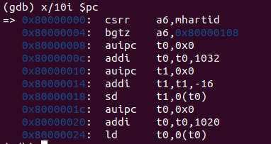
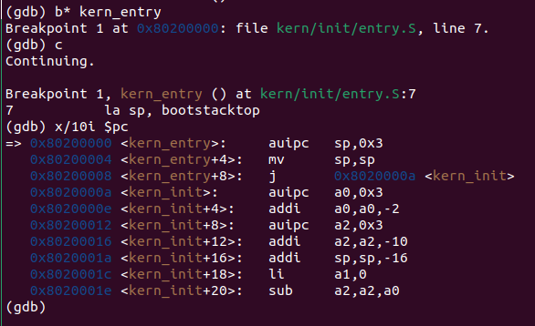
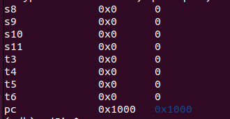
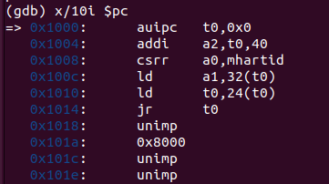
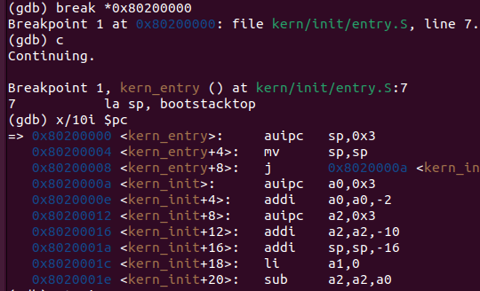
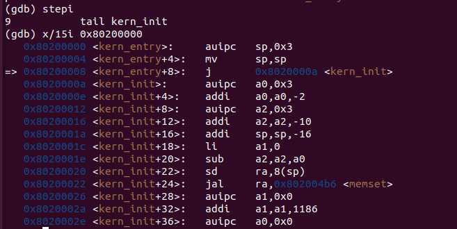

# 实验报告：[Lab1]

**作者：** [刘玥彤2312747] [杨凝霜2314009] [梁杰2313771]

---


### 1.1 实验目的

实验1主要讲解最小可执行内核和启动流程。我们的内核主要在 Qemu 模拟器上运行，它可以模拟一台 64 位 RISC-V 计算机。为了让我们的内核能够正确对接到 Qemu 模拟器上，需要了解 Qemu 模拟器的启动流程，还需要一些程序内存布局和编译流程（特别是链接）相关知识。
本章你将学到：

- 使用 链接脚本 描述内存布局
- 进行 交叉编译 生成可执行文件，进而生成内核镜像
- 使用 OpenSBI 作为 bootloader 加载内核镜像，并使用 Qemu 进行模拟
- 使用 OpenSBI 提供的服务，在屏幕上格式化打印字符串用于以后调试
  
---

### 1.2 实验内容

实验1主要讲解最小可执行内核和启动流程。我们的内核主要在 Qemu 模拟器上运行，它可以模拟一台 64 位 RISC-V 计算机。为了让我们的内核能够正确对接到 Qemu 模拟器上，需要了解 Qemu 模拟器的启动流程，还需要一些程序内存布局和编译流程（特别是链接）相关知识,以及通过opensbi固件来通过服务。

---

### 2.1 练习1：理解内核启动中的程序入口操作

阅读 kern/init/entry.S内容代码，结合操作系统内核启动流程，说明指令 la sp, bootstacktop 完成了什么操作，目的是什么？ tail kern_init 完成了什么操作，目的是什么？

**下部分由【刘玥彤2312747】编写。**

1.**la sp, bootstacktop指令**
bootstacktop 标签在文件的 .data 段中被定义，它位于 bootstack 这块预留的栈内存空间的最高地址处。执行指令将 bootstacktop 这个标签的内存地址加载到 sp 寄存器中，这样，sp 寄存器就指向了内核初始栈的顶部。
这条指令的目的是初始化内核的第一个栈，设置一个合法的栈指针，为 C 函数调用做准备。

2.**tail kern_init指令**
它使程序的执行流直接跳转到 kern_init 标签所在的地址，并且不会在栈上保存返回地址。这意味着，kern_entry 这个函数的使命到此结束，程序将一去不复返地进入 kern_init 函数。
这条指令的目的是将控制权从汇编代码移交给 C 代码。汇编代码 kern_entry 的任务已经完成，现在需要跳转到用 C 语言编写的内核主初始化函数 kern_init() 中，并且永远不需要返回。

**下部分由【杨凝霜2314009】编写。**

阅读 kern/init/entry.S内容代码，结合操作系统内核启动流程，说明：

- 指令 `la sp, bootstacktop` 完成了什么操作，目的是什么？

  答：该指令将`bootstacktop` 的地址加载到栈指针寄存器 `sp` 中。目的是为内核代码的执行建立栈空间，将栈指针指向预先分配的内核栈的顶部。

- tail kern_init 完成了什么操作，目的是什么？

​	答：`tail` 是尾调用伪指令，相当于直接跳转，跳转到 `kern_init` 函数，是“真正的”内核入口点。使用尾调用优化，不会在栈上创建新的栈帧。

**下部分由【梁杰2313771】编写。**

阅读 kern/init/entry.S内容代码，结合操作系统内核启动流程

- 指令 `la sp, bootstacktop`将符号 bootstacktop 对应的内存地址值，写入到栈指针寄存器 sp 中。；核心目的在于初始化内核的栈空间，建立可用的执行环境，将栈指针设置到栈顶。

- tail kern_init 使CPU 直接跳转到 kern_init 函数的起始地址开始执行。tail 不会将当前函数的返回地址压入栈中，核心目的在于以最优的方式跳转到第一个 C 函数，并且不期望返回。

### 2.2 练习2: 使用GDB验证启动流程

为了熟悉使用 QEMU 和 GDB 的调试方法，请使用 GDB 跟踪 QEMU 模拟的 RISC-V 从加电开始，直到执行内核第一条指令（跳转到 0x80200000）的整个过程。通过调试，请思考并回答：RISC-V 硬件加电后最初执行的几条指令位于什么地址？它们主要完成了哪些功能？请在报告中简要记录你的调试过程、观察结果和问题的答案。

**下部分由【刘玥彤2312747】编写。**

1.  **准备工作：** 
   配置RISC-V GDB环境，并启动QEMU模拟器。

2.  **核心操作：** 
   在vscode中使用“拆分终端”，在左边的终端中执行*make debug*，负责启动 QEMU 并让它等待，在右边的终端中执行*make gdb*。
   
   现在我们执行几条指导书上的指令验证一下环境是否配置成功。
   执行 *b kern_entry* 指令，将调试器（GDB）定位到内核入口点并设置断点。输出表示 GDB 成功地将符号 kern_entry 解析为了内存地址 0x80200000，证明代码被正确地链接和加载到了预期的位置。
   执行 c 指令，让程序继续执行，并等待断点。
   Breakpoint 1, kern_entry () at kern/init/entry.S:7表示它命中了我们之前设置的 1 号断点，停止的位置是 kern_entry 函数，位于 entry.S 文件的第 7 行。并且显示了程序即将要执行的下一条指令的源代码。
   
   执行 i r 指令，查看当前所有寄存器的值。ra , sp 的值都在 0x8001xxxx 范围内，这表明 CPU 暂停时，正在执行的代码和使用的栈都位于 OpenSBI 的内存空间内。
   
   执行 info registers pc 指令，查看当前正在执行的指令.程序计数器的值是 0x1000,表明当前暂停在 QEMU 模拟的 ROM 中的复位地址处。
   执行 b *0x80200000 设置断点，这个地址是内核代码第一条指令所在的位置。
   执行 display /i $pc ，自动显示当前正在执行的指令。
   反复执行 si 指令，让程序单步执行，可以查看当前正在执行的指令。
   下图展示的过程主要是先通过一系列 addi 指令计算出下一个程序的入口地址，并存入 t0 寄存器，然后 jr t0 跳转到下一个程序入口，pc 的值变成了 0x80000000，标志着CPU 的控制权已经从 QEMU 的 ROM 成功交接给了 OpenSBI 固件。
   
   由于到终点的指令太多，我们直接执行 c 指令，让程序运行到断点为止。
   输出结果展示了 entry.S 中读取到的第 7 行内容。还有在内存地址 0x80200000 处，CPU 实际要执行的第一条指令是 auipc sp, 0x3。
   
   
   3. **回答问题：**
   
   (1)RISC-V 硬件加电后最初执行的几条指令位于什么地址？
   从开始0x1000 ，它是QEMU 预设的复位向量地址。

   (2)它们主要完成了哪些功能？
   - **0x1000** 计算一个基地址，为了实现位置无关代码。
   - **0x1004** 计算一个配置数据的地址。
   - **0x1008** 读取当前硬件线程（CPU 核心）的 ID，存入 a0 寄存器。
   - **0x100c** 从内存中加载OpenSBI的入口地址到 t0 寄存器。
   - **0x1010** 跳转到 t0 寄存器中存储的地址。

**下部分由【杨凝霜2314009】编写。**

答：最初执行的几条指令地址位于0x1000，0x1004，0x1008，0x100c，0x1010，0x1014。

​	主要完成了:设置基本执行环境、获取硬件信息、准备跳转参数，通过 `jr t0` 跳转到 OpenSBI 等功能。

```assembly
0x1000: auipc t0, 0x0        # 将当前PC的高20位与立即数0相加存入t0，计算当前代码位置的基地址
0x1004: addi a2, t0, 40      # 将t0+40（即0x1028）存入a2，准备某个数据结构的地址
0x1008: csrr a0, mhartid     # 读取当前硬件线程ID到a0
0x100c: ld a1, 32(t0)        # 从t0+32（即0x1020）处加载数据到a1
0x1010: ld t0, 24(t0)        # 从t0+24（即0x1018）处加载数据到t0
0x1014: jr t0                # 跳转到t0指向的地址
```

调试过程：

1. 在终端1执行`make debug`

2. 在终端2执行`make gdb`

3. 在GDB中执行：
   `(gdb) break *0x1000`
   `(gdb) x/10i $pc`

   结果如下图：

   ​	

4. 随后使用`si`命令单步执行，直到执行到`0x1014: jr t0`，pc跳转至0x80000000，即跳转至OpenSBI.bin所在位置。

	

7. 在GDB中执行：
   	`(gdb) x/10i $pc`

   结果如下图：

   ​	

   ```assembly
   # 核心ID检查
   0x80000000:  csrr    a6, mhartid     # 读取当前硬件线程ID到a6寄存器
   0x80000004:  bgtz    a6, 0x80000108  # 如果核心ID > 0（非0号核心），跳转到0x80000108
   # 设置陷阱向量（Trap Vector）
   0x80000008:  auipc   t0, 0x0         # t0 = PC + 0 = 0x80000008
   0x8000000c:  addi    t0, t0, 1032    # t0 = 0x80000008 + 1032 = 0x80000410
   0x80000010:  auipc   t1, 0x0         # t1 = PC + 0 = 0x80000010
   0x80000014:  addi    t1, t1, -16     # t1 = 0x80000010 - 16 = 0x80000000
   0x80000018:  sd      t1, 0(t0)       # 将t1的值(0x80000000)存储到t0指向的地址(0x80000410)
   # 加载设备树地址或其他配置信息
   0x8000001c:  auipc   t0, 0x0         # t0 = PC + 0 = 0x8000001c
   0x80000020:  addi    t0, t0, 1020    # t0 = 0x8000001c + 1020 = 0x80000418
   0x80000024:  ld      t0, 0(t0)       # 从地址0x80000418加载数据到t0
   ```

   

8. 在GDB中执行：
   	`(gdb) b* kern_entry`

   ​	`(gdb) c`

   ​	`(gdb) x/10i $pc`

   结果如下图：

	

```assembly
# 内核入口点 (kern_entry)
0x80200000 <kern_entry>:     auipc   sp,0x3
0x80200004 <kern_entry+4>:   mv      sp,sp
0x80200008 <kern_entry+8>:   j       0x8020000a <kern_init> # 无条件跳转到地址 0x8020000a（kern_init标签）
```


**下部分由【梁杰2313771】编写。**

调试过程及结果展示：

1.遵照实验指导配置risc-v GDB环境，启动qemu模拟器，并将GDB连接到QEMU上
  
  结果显示连接成功，PC指向0x1000

  

2.展示复位向量处的指令，执行'x/10i $pc'，据此可以回答问题：
 
 

  可以发现最初执行的几条指令地址分别位于0x1000，0x1004，0x1008，0x100c，0x1010，0x1014。

  其主要指令功能,以及功能实现过程中应当出现的寄存器变化总结如下：

- 0x1000	auipc t0, 0x0	    代码定位 - 获取当前执行位置，为后续数据访问建立基址	     t0 = 0x1000
  
- 0x1004	addi a2, t0, 40	  参数准备 - 计算启动参数地址	                           a2 = 0x1028
  
- 0x1008	csrr a0, mhartid	核心识别 - 读取当前CPU硬件线程ID	                     a0 = CPU核心编号
  
- 0x100c	ld a1, 32(t0)	    硬件配置 - 加载设备树(DTB)物理地址	                   a1 = 设备树地址
  
- 0x1010	ld t0, 24(t0)	    入口获取 - 加载操作系统内核入口地址	                   t0 = 内核入口地址
  
- 0x1014	jr t0	            控制转移 - 跳转到操作系统内核执行	                     PC = t0

3.设置内核入口处的断点,continue执行并展示内核开始的前10条指令

  结果显示如图：

  

4.反复执行了两次stepi指令，查看后续执行的指令内容，并通过'x/15i 0x80200000'从内核开始位置重新展示了15条指令，也可以从中发现已执行到的指令位置

   结果显示如图：

  


## 3. 讨论

### 3.1 实验涉及的知识点内容

**1. 多阶段启动链条**

**实验现象**：通过GDB单步跟踪观察到CPU执行流从复位向量0x1000 → OpenSBI(0x80000000) → 内核入口(0x80200000)

**对应OS原理**：操作系统引导(BootLoading)

**理解与差异**：

- 深刻认识到内核并非直接运行在裸机上，而是运行在引导程序精心准备的环境中
- 内核的第一条指令是整个启动链条的最后一步
- 实验展示了从硬件复位到内核执行的完整路径，包括固件初始化、参数传递和控制权转移

**2. 内核栈初始化**

**实验现象**：内核入口`kern_entry`的第一条指令设置栈指针`sp`

**对应OS原理**：进程/线程上下文与函数调用栈

**理解**：

- 任何程序的执行都需要栈空间来支持函数调用、参数传递和局部变量存储
- `la sp, bootstacktop`指令为整个OS内核创建第一个基础执行上下文
- 栈空间是内核运行的基础设施

**3. 链接脚本与内存布局**

**实验现象**：使用链接脚本(.ld文件)描述内核在内存中的布局

**对应OS原理**：程序内存布局（代码段、数据段、堆栈段）

**关系与差异**：

- **相同点**：都涉及分段管理和地址空间概念
- **差异**：实验关注内核级别内存布局且需手动指定地址，原理更多关注用户程序布局并由OS自动管理
- 实验通过链接脚本明确定义了.text、.rodata、.data、.bss等段的物理位置

**4. 交叉编译与目标架构**

**实验现象**：在x86主机上使用RISC-V交叉编译工具链编译内核

**对应OS原理**：系统可移植性与硬件抽象层

**理解**：

- 都体现了操作系统与硬件平台的解耦思想
- 实验通过交叉编译工具链实现，原理通过硬件抽象层实现

**5. 可执行文件格式**

**实验内容**：ELF格式（记载信息）与BIN格式（记载程序本身）

**理解**：

- ELF文件通过段信息描述程序结构，BIN文件直接包含可执行代码
- 对于初始化为零的大数组，ELF只需记录起止位置，BIN需要实际占用空间

**6. 固件服务与系统调用**

**实验现象**：通过OpenSBI提供的服务进行I/O操作

**对应OS原理**：系统调用接口

**差异**：

- 实验通过`ecall`指令陷入M模式调用固件服务
- 原理中通过系统调用陷入内核态
- 实验中的"系统调用"实际上是固件服务调用，而非完整OS的系统调用

### 3.2 实验仍未涉及的部分

1. **虚拟内存与分页机制**：实验直接使用物理内存，未实现虚拟地址管理
2. **进程管理与调度**：包括进程控制块、上下文切换和调度算法等核心机制
3. **文件系统**：存储管理、目录结构和缓存机制等
4. **并发与同步机制**：多线程环境下的同步原语
5. **完整的设备驱动与I/O管理**：实验仅通过OpenSBI进行简单I/O
6. **系统调用实现机制**：完整的系统调用陷入机制和参数传递规范
7. **中断与异常处理**：硬件中断处理和异常处理机制
8. **动态内存管理**：堆内存的分配和回收机制
