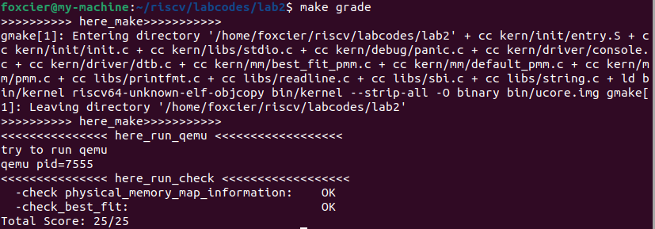
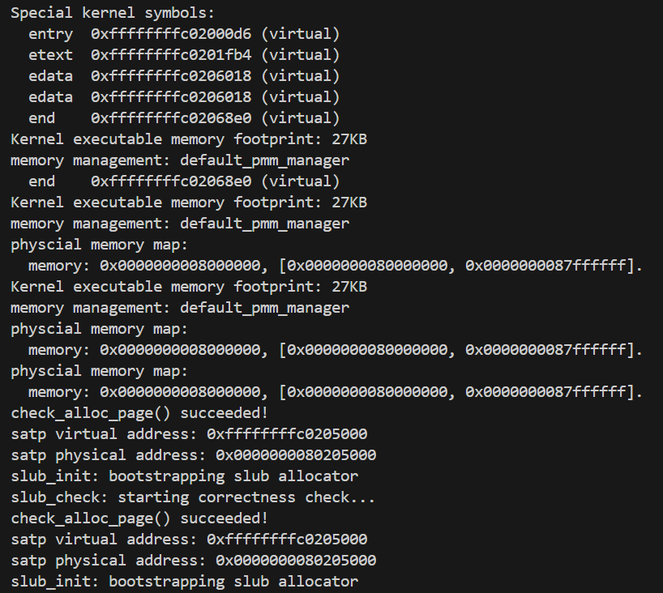
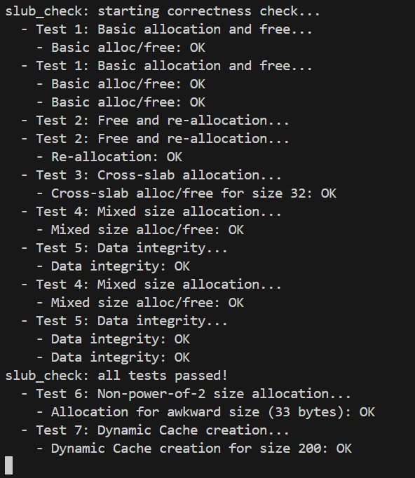

# lab2实验报告

刘玥彤 杨凝霜 梁杰

___

### 练习1：理解first-fit 连续物理内存分配算法

#### 核心思想

`first-fit`算法是物理内存分配中的一种基础方法，其核心思想是维护一个空闲块链表，当收到内存分配请求时，从链表头部开始扫描，找到第一个足够大的空闲块进行分配。如果该空闲块大于请求大小，则将其分割，剩余部分重新加入空闲链表。释放内存时，将释放的块插入空闲链表，并尝试与相邻空闲块合并以减少碎片。


#### 代码分析

##### 1. `default_init`函数

```c
static void
default_init(void) {
    list_init(&free_list);
    nr_free = 0;
}
```

该函数用于初始化物理页管理器的空闲区状态：把空闲链表 free_list 设为空，并将可用空闲页计数 nr_free 置为 0，为后续内存区块的插入、分配与释放做好初始准备。

`list_init`函数：

```c
static inline void
list_init(list_entry_t *elm) {
    elm->prev = elm->next = elm;  // 将前后指针都指向自己，形成自环
}
```


##### 2. `default_init_memmap`函数

```c
static void
default_init_memmap(struct Page *base, size_t n) {
    // 步骤1: 参数校验和页面初始化
    assert(n > 0);  // 确保请求初始化的页面数大于0
    
    struct Page *p = base;
    // 遍历空闲块中的每个页面，进行初始化
    for (; p != base + n; p ++) {
        assert(PageReserved(p));  // 确认页面处于保留状态
        
        // 初始化页面标志位和属性值
        p->flags = p->property = 0;  // 清空标志位和属性值
        set_page_ref(p, 0);          // 设置页面引用计数为0（当前无引用）
    }
    
    // 步骤2: 设置空闲块属性
    base->property = n;      // 在基页面中记录整个空闲块的大小
    SetPageProperty(base);   // 设置基页面的PG_property标志，表示这是一个有效空闲块的起始页
    
    // 步骤3: 更新空闲页面统计
    nr_free += n;           // 增加全局空闲页面计数器
    
    // 步骤4: 将空闲块插入有序链表（按物理地址升序排列）
    if (list_empty(&free_list)) {
        // 情况1: 如果空闲链表为空，直接添加到链表
        list_add(&free_list, &(base->page_link));
    } else {
        // 情况2: 链表非空，需要找到正确的插入位置
        list_entry_t* le = &free_list;  // 从链表头开始遍历
        
        // 遍历空闲链表，寻找合适的插入位置
        while ((le = list_next(le)) != &free_list) {
            struct Page* page = le2page(le, page_link);  // 将链表项转换为页面结构
            
            // 比较地址大小，保持链表按地址升序排列
            if (base < page) {
                // 找到第一个地址大于当前块的页面，插入到它前面
                list_add_before(le, &(base->page_link));
                break;  // 插入完成，退出循环
            } else if (list_next(le) == &free_list) {
                // 如果到达链表尾部且当前块地址最大，插入到链表末尾
                list_add(le, &(base->page_link));
            }
        }
    }
}
```

`default_init_memmap` 函数的主要作用是将一段连续的物理内存页面初始化为可管理的空闲内存块，并将其整合到系统的空闲内存管理结构中。

函数首先进行基本的参数验证，确保请求初始化的页面数量大于零，这是后续操作的前提条件。接着，函数遍历这段连续的物理内存区域中的每一个页面，对它们进行初始化处理。在这个过程中，函数会确认每个页面确实处于预留状态，然后将每个页面的标志位和属性字段清零，同时将页面的引用计数设置为零。这一步骤的意义在于将这些页面从原始的、"未管理"的状态转换为内存管理器可以识别和操作的标准空闲页面状态。

在完成对所有页面的基础初始化后，函数着重处理这个空闲内存块的整体属性。它将整个空闲块的大小信息记录在基页面的 `property` 字段中，并在基页面设置 `PG_property` 标志位。

随后，函数更新全局的空闲页面计数器 `nr_free`，增加相应数量的页面，这为后续的内存分配算法提供了重要信息。接下来是最为关键的一步：将这个新初始化的空闲块插入到系统的空闲页面链表中。这里采用了按物理地址升序排列的策略，即保持链表中各个空闲块按照它们的起始物理地址从小到大有序排列。这种排序方式不是随意的，而是为了支持后续内存释放时的相邻块合并操作。当链表为空时，插入操作很简单；当链表非空时，函数会遍历链表，通过比较地址大小找到合适的插入位置，确保链表的有序性得以维持。


##### 3. `default_alloc_pages`函数

```c
static struct Page *
default_alloc_pages(size_t n) {
    // 步骤1: 参数验证和快速失败检查
    assert(n > 0);                      // 确保请求的页面数有效
    if (n > nr_free) {                  // 检查是否有足够的空闲页面
        return NULL;                    // 内存不足，直接返回NULL
    }
    
    // 步骤2: 在空闲链表中搜索合适的空闲块
    struct Page *page = NULL;           // 用于记录找到的合适页面
    list_entry_t *le = &free_list;      // 从空闲链表头开始遍历
    
    // 使用First-Fit策略：找到第一个大小足够的空闲块
    while ((le = list_next(le)) != &free_list) {
        struct Page *p = le2page(le, page_link);  // 将链表项转换为页面结构
        if (p->property >= n) {         // 找到第一个大小满足要求的空闲块
            page = p;                   // 记录找到的页面
            break;                      // 停止搜索（First-Fit特性）
        }
    }
    
    // 步骤3: 处理找到的空闲块
    if (page != NULL) {
        // 记录当前页面的前驱节点，用于后续插入操作
        list_entry_t* prev = list_prev(&(page->page_link));
        
        // 从空闲链表中移除找到的页面
        list_del(&(page->page_link));
        
        // 步骤4: 处理空闲块分割（如果找到的块大于请求大小）
        if (page->property > n) {
            // 计算剩余部分的起始页面
            struct Page *p = page + n;
            // 设置剩余部分的大小属性
            p->property = page->property - n;
            // 标记剩余部分为有效空闲块
            SetPageProperty(p);
            // 将剩余部分插入到原位置
            list_add(prev, &(p->page_link));
        }
        
        // 步骤5: 更新系统状态
        nr_free -= n;                   // 减少全局空闲页面计数
        ClearPageProperty(page);        // 清除分配页面的属性标志
    }
    
    return page;                        // 返回分配结果
}
```

`default_alloc_pages` 函数实现了`First-Fit`内存分配算法。该函数的主要作用是分配指定数量的连续物理页面，满足内核或应用程序的内存需求。

函数首先进行基本的检查，确保请求的页面数量有效，并且系统中有足够的空闲页面来满足请求。如果这些初步检查失败，函数会立即返回NULL，避免不必要的计算开销。

在确认请求合法后，函数开始在空闲内存链表中进行搜索。这里采用了首适应算法：从链表头部开始顺序遍历，找到第一个大小满足要求的空闲内存块。这种算法的优势在于实现简单、搜索速度快，特别适合中小规模的内存管理系统。搜索过程中，函数利用`le2page`宏将链表节点转换为对应的页面结构，并检查每个空闲块的`property`字段以确定其大小是否足够。

当找到合适的空闲块后，函数进入内存分配的实际操作阶段。首先，它记录当前块在链表中的前驱节点，这个信息在后续的分割操作中非常重要。然后，函数将选中的空闲块从链表中移除，表示这部分内存不再可用。如果选中的空闲块恰好等于请求大小，分配过程相对简单；但如果空闲块大于请求大小，函数会执行分割操作：将空闲块分成两部分，前一部分用于满足当前请求，后一部分作为新的、较小的空闲块重新插入到链表中。这种分割策略有效地减少了内部碎片，提高了内存利用率。

在完成内存分配后，函数更新系统的全局状态：减少空闲页面计数器，并清除已分配页面的属性标志。


##### 4. `default_free_pages`函数

```c
static void
default_free_pages(struct Page *base, size_t n) {
    // 步骤1: 参数验证和页面状态检查
    assert(n > 0);  // 确保释放的页面数有效
    
    struct Page *p = base;
    // 遍历要释放的所有页面，验证状态并重置页面属性
    for (; p != base + n; p ++) {
        // 确认页面既不是保留页面也不是属性页面（即确实是已分配页面）
        assert(!PageReserved(p) && !PageProperty(p));
        p->flags = 0;        // 清空页面标志位
        set_page_ref(p, 0);   // 重置页面引用计数为0
    }
    
    // 步骤2: 将释放的页面块初始化为新的空闲块
    base->property = n;      // 设置基页面的property字段，记录空闲块大小
    SetPageProperty(base);   // 标记基页面为有效空闲块的起始页
    nr_free += n;           // 更新全局空闲页面计数器
    
    // 步骤3: 将新空闲块按地址顺序插入空闲链表
    if (list_empty(&free_list)) {
        // 如果空闲链表为空，直接添加
        list_add(&free_list, &(base->page_link));
    } else {
        // 链表非空，需要找到正确的插入位置以保持地址升序
        list_entry_t* le = &free_list;
        while ((le = list_next(le)) != &free_list) {
            struct Page* page = le2page(le, page_link);
            if (base < page) {
                // 找到第一个地址大于当前块的页面，插入到它前面
                list_add_before(le, &(base->page_link));
                break;
            } else if (list_next(le) == &free_list) {
                // 如果到达链表尾部，插入到末尾
                list_add(le, &(base->page_link));
            }
        }
    }
    
    // 步骤4: 向前合并 - 检查是否能与前面的空闲块合并
    list_entry_t* le = list_prev(&(base->page_link));
    if (le != &free_list) {
        p = le2page(le, page_link);  // 获取前一个空闲块
        // 检查前一个空闲块的末尾是否紧邻当前块的起始
        if (p + p->property == base) {
            p->property += base->property;  // 合并块大小
            ClearPageProperty(base);        // 清除当前块的属性标志
            list_del(&(base->page_link));   // 从链表中移除当前块
            base = p;                       // 将base指向合并后的块
        }
    }
    
    // 步骤5: 向后合并 - 检查是否能与后面的空闲块合并
    le = list_next(&(base->page_link));
    if (le != &free_list) {
        p = le2page(le, page_link);  // 获取后一个空闲块
        // 检查当前块的末尾是否紧邻后一个块的起始
        if (base + base->property == p) {
            base->property += p->property;  // 合并块大小
            ClearPageProperty(p);           // 清除后一个块的属性标志
            list_del(&(p->page_link));      // 从链表中移除后一个块
        }
    }
}
```

`default_free_pages` 函数的主要作用是将已分配的连续物理页面安全地释放，并通过合并机制减少内存碎片，提高内存利用率。

函数首先进行严格的参数验证和状态检查，确保要释放的页面数量有效，并且所有要释放的页面确实处于已分配状态。在确认所有参数和状态正确后，函数遍历要释放的每一个页面，重置它们的标志位和引用计数，为重新纳入空闲管理系统做好准备。

接下来，函数将释放的页面集合初始化为一个新的空闲内存块。这一过程包括在基页面设置`property`字段记录块的大小，标记`PG_property`标志表明这是一个有效空闲块的起始页，并更新全局空闲页面计数器。这些操作将原本分散的已分配页面组织成一个结构化的空闲内存单元。

随后，函数将这个新创建的空闲块按照物理地址升序插入到空闲链表中。

函数的核心价值体现在最后两个步骤：向前合并和向后合并操作。这些操作检查新插入的空闲块是否与链表中相邻的空闲块在物理地址上连续。如果发现连续的块，函数会将它们合并成一个更大的连续空闲块，同时更新相应的`property`字段和链表结构。这种合并机制极大地减少了外部碎片问题，将多个小空闲块整合成大块，提高了后续大内存分配请求的成功率。


##### 5.其他函数

- **default_nr_free_pages(void)**

  返回当前全局空闲页数 nr_free。

- **basic_check(void)**

  调用 alloc_page / free_page，检查引用计数、地址范围、链表状态等断言。函数在测试过程中会临时保存并恢复 free_list 与 nr_free，用于验证单页分配的正确性和基本不变式。

- **default_check(void)**

  对默认物理内存管理器的完整性检查，包括遍历 free_list 校验 property 与 nr_free_pages() 相符、调用 basic_check()，以及一系列多页分配/释放用例以验证 first‑fit 分配与合并逻辑。

- **default_pmm_manager（结构体常量）**

  将上述实现以函数指针形式注册为一个物理内存管理器（包含 name、init、init_memmap、alloc_pages、free_pages、nr_free_pages、check 等入口），供内核在初始化时选择并使用。


#### 物理内存分配过程

1. **初始化**：启动时，通过`default_init`初始化空闲链表和计数器。然后，`default_init_memmap`将可用的物理内存区域划分为空闲块，按地址升序插入空闲链表，并设置页面属性和全局空闲页面计数。
2. **分配**：当请求分配内存时，`default_alloc_pages`遍历空闲链表，找到第一个大小足够的空闲块。如果块过大，则分割该块，剩余部分重新插入链表。分配后更新空闲页面计数。
3. **释放**：释放内存时，`default_free_pages`将释放的块重新插入空闲链表，并检查与相邻块的连续性，进行合并操作以形成更大的连续空闲块，减少内存碎片。


#### first-fit算法的改进空间

1. **碎片问题**：first-fit容易产生外部碎片，尤其是当小空闲块累积在链表头部时。改进方法包括：
   - 使用更复杂的算法如最佳适应（best-fit）或最坏适应（worst-fit），但会增加开销。
   - 定期碎片整理（compaction），但需要移动数据，成本较高。
2. **搜索效率**：链表扫描是O(n)时间复杂度，对于大内存系统可能较慢。改进方法包括：
   - 使用平衡树（如AVL树或红黑树）来存储空闲块，按大小或地址组织，加快搜索速度。
   - 实现分离空闲链表（segregated free lists），将不同大小的块分组管理。
3. **合并策略**：当前实现仅在释放时合并相邻块，但可以探索更积极的合并策略，例如在分配时也检查合并机会。
4. **预分配与缓存**：针对常见请求大小，维护特定大小的缓存块，减少分割和合并操作。


____

### 练习2：实现 Best-Fit 连续物理内存分配算法

#### 核心思想

`Best-Fit` 算法的核心思想是在分配内存时，从所有满足大小的空闲块中选择**大小最接近**请求大小的块，以减少内存碎片。相比 `First-Fit` 算法，`Best-Fit` 在碎片控制方面表现更好。


#### 代码设计

`Best-Fit` 算法和`First-Fit` 算法的区别主要在`best_fit_alloc_pages()`函数。

```c
static struct Page *
best_fit_alloc_pages(size_t n) {
    // ...
    size_t min_size = nr_free + 1;  // 记录最小合适大小
    
    while ((le = list_next(le)) != &free_list) {
        struct Page *p = le2page(le, page_link);
        if (p->property >= n && p->property < min_size) {
            page = p;
            min_size = p->property;  // 更新最小合适大小，继续搜索
        }
    }
    // ...
}
```

设计思路如下：

首先，分析空闲链表的结构。空闲链表按物理地址升序排列，每个空闲块由基页面管理，其中 `property` 字段记录块的大小。在 Best-Fit 中，我需要遍历所有空闲块，找到大小最接近 `n` 的块。这自然引出了一个想法：必须使用循环遍历整个链表，不能提前退出，否则可能错过更合适的块。

在循环设计中，我们意识到需要两个变量来跟踪最佳候选：一个指向当前最佳块的指针 `page`，和一个记录当前最佳块大小的 `min_size`。初始化时，我们将 `min_size` 设置为 `nr_free + 1`，因为 `nr_free` 是系统总空闲页面数，所以 `nr_free + 1` 肯定大于任何单个空闲块的大小，这确保了第一个满足条件的块能被正确记录。然后，在循环中，对于每个块，我们检查两个条件：一是块大小是否大于等于请求大小 `n`，二是块大小是否小于当前记录的 `min_size`。如果两个条件都满足，就更新 `page` 和 `min_size`。这样，循环结束后，`page` 就指向大小最接近 `n` 的块。

与 `First-Fit` 相比，`Best-Fit` 的循环没有 `break` 语句，这是关键区别。`First-Fit` 在找到第一个满足条件的块后就跳出循环，而 `Best-Fit` 必须继续遍历，以确保找到全局最优解。虽然这增加了时间复杂度（从 O(1) 平均情况到 O(n)），但换来了更好的内存利用率。在内存资源紧张的系统中，这种权衡是值得的。

在实现中，我们还考虑了边界情况。例如，如果没有足够大的块，循环结束后 `page` 仍为 NULL，函数返回 NULL。如果找到的块大于请求大小，就像 `First-Fit` 一样进行分割：将剩余部分作为新空闲块重新插入链表。这保持了内存管理的连贯性。


#### 测试结果

修改`pmm_manager`如下：

```c
static void init_pmm_manager(void) {
    pmm_manager = &best_fit_pmm_manager;  // 修改pmm_manager
    cprintf("memory management: %s\n", pmm_manager->name);
    pmm_manager->init();
}
```

运行`make grade`指令，结果如下：




_____

### 扩展练习Challenge1：buddy system（伙伴系统）分配算法

#### 1. 算法概述

在CoolShell《伙伴分配器的一个极简实现》一文的指导下，我们设计了Buddy System内存分配器。该文的核心思想是将内存按2的幂次方进行分层管理，我们依此实现了多阶空闲链表结构。具体设计中，我们建立了0到10阶共11个空闲链表，每个链表管理不同大小的内存块（从1页到1024页）。

分配算法遵循文中的"向上查找-向下分割"策略：当请求n页内存时，首先计算满足2^k ≥ n的最小k值，然后从k阶开始向上搜索可用块，找到后如块过大则递归对半分割，将剩余部分作为伙伴块插入对应链表。

释放算法则实现了文中所说的"伙伴合并"机制，通过地址异或运算快速定位伙伴块，检查其是否空闲且大小相同，如满足条件则递归合并成更大块。这种设计确保了O(log n)的时间复杂度，同时通过合并机制有效减少了外部碎片。

#### 2. 数据结构设计

##### 2.1 核心数据结构

```c
// 每个阶数(order)的空闲链表

static list_entry_t buddy_free_lists[MAX_ORDER + 1];

// 页面到阶数的映射

static int page_orders[1 << 20];
```


##### 2.2 内存块表示

\- 每个空闲块只有**第一页**存储元数据 (`property` 字段)

\- `property` 字段记录块包含的页面数

\- 使用 `page_link` 将块链接到对应阶数的空闲链表

 

#### 3.核心函数功能说明

##### 3.1 初始化函数

 **`buddy_init()`**

**功能**：初始化Buddy System管理器

\- 初始化所有阶数的空闲链表（0到MAX_ORDER）

\- 重置空闲页面计数器`nr_free`为0

\- 为后续内存映射初始化做准备


**`buddy_init_memmap(struct Page *base, size_t n)`**

**功能**：将物理内存区域初始化为Buddy System可管理的空闲块

\- 参数：`base`-内存起始页面指针，`n`-页面数量

\- 验证内存区域有效性（n > 0）

\- 初始化每个页面的标志位和引用计数

\- 将内存区域按最大可能的2的幂次方进行分割

\- 递归或迭代处理剩余的非2幂次方内存

\- 更新系统总空闲页面数`nr_free`

 

##### 3.2 内存分配函数

**`buddy_alloc_pages(size_t n)`**

**功能**：分配n个连续物理页面

\- 参数：`n`-请求的页面数

\- 计算满足2^order ≥ n的最小order值

\- 从order开始向上搜索可用空闲块

\- 如果找到合适块，从链表中移除并可能进行分割

\- 返回分配的内存块首页面指针，失败返回NULL

 

##### 3.3 内存释放函数

#####  `buddy_free_pages(struct Page *base, size_t n)`

**功能**：释放之前分配的物理页面

\- 参数：`base`-释放内存的起始页面，`n`-页面数量

\- 验证释放参数的合法性

\- 将释放的块标记为空闲状态

\- 尝试与相邻伙伴块合并，递归向上合并直到无法合并

\- 将最终块加入对应阶数的空闲链表

\- 更新系统空闲页面计数

 

##### 3.4 辅助函数

##### **`buddy_nr_free_pages()`**

**功能**：返回当前系统空闲页面总数

\- 直接返回`nr_free`计数器值

\- 用于系统内存状态监控

 

 **`buddy_check()`**

**功能**：Buddy System自检函数

\- 测试分配释放基本功能

\- 验证伙伴合并机制正确性

\- 输出测试结果和诊断信息

 

 **`is_buddy(struct Page *base, struct Page *p, int order)`**

**功能**：判断两个块是否为伙伴关系

\- 参数：`base`-参考基准，`p`-待判断块，`order`-阶数

\- 检查地址范围有效性

\- 验证页面属性和阶数匹配

\- 返回布尔值表示是否为伙伴

 

#### 4.核心算法实现

##### 4.1 初始化过程 `buddy_init_memmap`

输入：基地址 base，页面数 n

过程：

1. 初始化所有页面的标志位
2. 找到 ≤ n 的最大 2^k 值
3. 将整个区域作为 order=k 的块加入空闲链表
4. 递归处理剩余页面

 

##### 4.2 分配算法 `buddy_alloc_pages`

输入：请求页面数 n

过程：

1. 计算满足 2^order ≥ n 的最小 order
2. 从 order 开始向上搜索可用块
3. 如果找到，从链表中移除
4. 如果块太大，不断分割直到合适大小
5. 返回分配的内存块

 

#####  4.3 释放算法 `buddy_free_pages`

输入：释放基地址 base，页面数 n

过程：

1. 计算对应的 order
2. 将块标记为空闲并加入对应链表
3. 循环尝试与伙伴块合并：

  \- 计算伙伴块地址

  \- 检查伙伴是否空闲且大小相同

  \- 如果可合并，移除伙伴并创建更大块

  \- 重复直到无法合并


#### 4.开发过程中遇到的问题

在实现和测试过程中，我们遇到了几个关键问题。首先是初始化阶段的断言失败，系统在调用check()函数时因内存状态不满足预期条件而中止。通过分析发现，Buddy System的初始化逻辑需要精确处理非2的幂次方内存区域，我们尝试采用了递归分割策略将剩余内存正确初始化。
其次是伙伴判断逻辑的边界情况处理，最初的设计未充分考虑内存边界检查，导致合并时访问非法内存。我们通过添加范围检查和状态验证解决了这一问题。

在测试阶段还出现过编译环节因头文件格式错误导致构建失败，通过手动重建文件并验证编码格式解决了此问题。

最后，原有的断言式测试在遇到轻微内存碎片化时就会失败，为此我们将测试改为容错式设计，即使部分测试失败也能继续执行并给出详细诊断信息。

______

### 扩展练习Challenge2：任意大小的内存单元slub分配算法

在 ucore 操作系统中，基于页级物理内存管理器（PMM），设计并实现一个高效的、用于小块内存分配的 Slub 内存分配器。
直接使用页级分配器（如 First-Fit 或 Buddy System）分配小块内存的弊端会导致严重的内部碎片和较低的分配效率。我们可以通过对象缓存的方式，预先从底层分配大块内存（Slab），然后将其切分成固定大小的对象进行管理，从而解决上述问题。

#### 设计思路

*代码均已上传到github仓库中，此处我们只做讲解就不展示代码了。*

1. 核心数据结构

   * struct Cache：用于管理一种特定大小的内存对象。包括管理 Slab 的链表头、对象大小、每个 Slab 能容纳的对象数。系统中的每一种尺寸的对象都有一个专属的 Cache 实例来负责其分配与回收。
   * struct Slab：从 PMM 申请到的一页或多页连续内存，是存放对象的容器。包括将自身链入 Cache 的节点、反向指针（方便释放）、空闲对象计数、用于追踪对象分配状态的位图、对象存储区的起始地址。
   * Slab 内存布局：我们采用了元数据与数据统一存放的策略，以节省一次额外的内存分配。在一个从 PMM 获取的 4KB 物理页中，其内部布局规划如下：

   ```
   [ Slab 结构体 | 位图区域 | (可能的对齐填充) | 连续的对象存储区 ]
   ```

2. 关键算法流程

**初始化（slub_init）**
初始化过程是一个“自举”流程，因为创建 Cache 本身也需要内存，而分配内存又依赖于 Cache。

* 首先，直接向页分配器申请一个物理页。
* 在栈上创建一个临时的 Cache 结构（temp_cache），用于管理 Cache 对象自身的分配。
* 将第一步申请到的物理页初始化为一个 Slab 结构（initial_slab），并让它的 cache 指针指向栈上的 temp_cache。
* 利用这个临时的 Slab，调用 slab_alloc_object 分配出第一个真正的 Cache 对象。这个对象将也可以说成是“管理 Cache 的 Cache”，我们定义为 kmem_cache_cache。
* 最后，用正确的值初始化 kmem_cache_cache；将 initial_slab 的 cache 指针修正，指向刚刚创建的 kmem_cache_cache；将 initial_slab 正式地添加到 kmem_cache_cache 的 slabs 链表中。

**kmalloc函数**

* 首先实现大小对齐，将用户请求的 size 向上取整到最近的 2 的幂次，这是为了将不同大小的请求归类到有限的几种 Cache 中。
* 根据规整后的大小，通过一个全局数组 cache_map 快速查找对应的 Cache 是否存在。如果 cache_map 中没有对应的 Cache，则调用 kmem_cache_create 函数，此函数会从 kmem_cache_cache 中分配一个 Cache 结构体的内存，并对其进行初始化，然后注册到 cache_map 中。
* 获取到目标 Cache 后，遍历其 slabs 链表，检查每个 Slab 的 free_count，如果大于 0，说明此 Slab 有空闲对象，则调用 slab_alloc_object 在该 Slab 中分配一个对象。如果遍历完所有 Slab 都没有找到空闲对象，则调用 create_new_slab 函数：从页分配器申请一个新页，将该页初始化为一个新的 Slab，将新 Slab 加入到当前 Cache 的 slabs 链表中，最后从这个新的 Slab 中分配对象。
* 最后分配对象，遍历 Slab 的位图，找到第一个为 0 的位，将该位置 1，表示已分配；根据位的索引计算出对应对象的内存地址并返回，将 Slab 的 free_count 减 1。

**kfree函数**

* 首先进行地址转换，根据要释放的指针 p，通过 kva2page 宏找到它所在的物理页 Page 结构。
* 在初始化 Slab 时，我们将 Slab 自身的指针存储在了 `page->page_link.next` 中。通过它，我们可以直接找到 Slab 结构体，进而通过 `slab->cache` 找到其所属的 Cache。
* 然后释放对象：根据对象地址 p 和 Slab 的对象起始地址 objs_start，计算出这是第几个对象。
  在位图中将对应的位置 0并且将 Slab 的 free_count 加 1。
* 最后别忘了检查 Slab 的 free_count 是否等于 cache->objs_per_slab。如果相等，意味着整个 Slab 中的所有对象都已被释放，此 Slab 变为空闲。此时需要将它从 Cache 的链表中移除，并调用 free_page 将整个物理页归还给页分配器，以避免系统持有过多空闲的 Slab 页。

3. 测试与验证

为了验证 slub 实现的正确性，我们设计了7个有针对性的测试用例。

- **基本分配与释放：** 验证 kmalloc 和 kfree 的基本功能。
- **重分配：** 验证释放后的内存可以被下一次分配复用。
- **跨 Slab 分配：** 验证当一个 Slab 被用尽后，系统能否自动创建新 Slab 并继续分配。
- **混合大小分配：** 验证不同大小的 Cache 能否协同工作。
- **数据完整性：** 验证分配的内存写入数据后，在释放前数据不会损坏。
- **非2的幂次大小分配：** 验证 roundup_pow_of_2 逻辑是否正确，能将请求路由到正确的 Cache。
- **动态 Cache 创建：** 验证当请求一个之前从未分配过的大小时，系统能否动态创建新的 Cache。

#### 输出结果




_______

### 扩展练习Challenge3：硬件的可用物理内存范围的获取方法

​	在现代计算机系统中，**优先使用可靠的固件接口**是操作系统获取物理内存范围的首选和最高效的方法。固件，如传统的BIOS或现代的UEFI，在加电自检过程中会详尽地探测和初始化硬件，并构建一份系统内存映射表。这份映射表不仅标明了可用的普通内存，还精确记录了那些被保留用于特定目的（如设备内存映射输入输出、系统固件、或ACPI表格）的内存区域，即所谓的“内存空洞”。操作系统无需亲自进行可能存在风险的探测，只需通过标准化的方式“询问”固件即可。

​	当固件接口不可用、不存在或被认为不可信时，操作系统必须依靠**内存探测**这一更为基础且直接的方法来自行发现可用物理内存。这是一种“自己动手”的方案，其核心思想是通过编程方式主动尝试读写不同的物理地址，并根据系统的反应来判断其是否可用。为了确保这个过程是“安全”的，操作系统不能进行盲目的访问，而必须建立完善的保护机制。通常，这需要通过预先设置一个异常处理程序来实现。探测过程开始时，内核会从较低的地址开始，以页为单位，执行一个“写入-读回-验证”的循环：它先向目标地址写入一个特定的测试模式，然后立即将其读回，如果读回的值与写入的值一致，则该页面很可能是一段可用的RAM。最关键的是，如果在写入或读取过程中触发了处理器异常，预先设置的异常处理程序会捕获到这个错误，将此地址范围标记为不可用，并优雅地恢复执行流程，从而避免系统宕机。尽管内存探测方法具有很强的通用性，几乎能在任何硬件平台上工作，但它也存在明显的缺点：速度缓慢，因为需要测试大量的地址；并且由于其侵入性，即使在严密的保护下，仍存在在特定硬件上引发不稳定性的微小风险。因此，它通常作为固件接口失效时的备用方案。